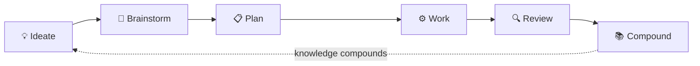

# human-compound

Forked from [compound-engineering-plugin](https://github.com/EveryInc/compound-engineering-plugin).

Human-first, team-driven engineering plugin. All the power of compound-engineering, plus a GitHub-based team coordination layer.

## What is this?

A Claude Code plugin that bundles:

1. **All compound-engineering skills and agents** -- the full workflow (`/he:ideate`, `/he:brainstorm`, `/he:plan`, `/he:work`, `/he:review`, `/he:compound`) plus 35+ specialized agents
2. **Team coordination layer** -- GitHub templates, Actions, and CODEOWNERS that make work visible across a 2-3 person team

No mandatory approvals. No heavyweight process. Just transparency.

## Components

| Component | Count |
|-----------|-------|
| Agents | 35+ |
| Skills | 40+ |
| GitHub Actions | 1 |
| Issue Templates | 2 |
| PR Templates | 5 |

## The Workflow



| Stage | Who | What happens | Artifact |
|-------|-----|-------------|----------|
| **Ideate** | Anyone | Open an Issue to propose ideas | GitHub Issue |
| **Brainstorm** | Anyone | Explore requirements via `/he:brainstorm` | `docs/brainstorms/*-requirements.md` |
| **Plan** | Engineer | Create implementation plan via `/he:plan` | `docs/plans/*-plan.md` |
| **Work** | Engineer | Execute the plan via `/he:work` | Code on feature branch |
| **Review** | Peer | Review code via `/he:review` + PR review | PR comments |
| **Compound** | Anyone | Capture learnings via `/he:compound` | `docs/solutions/**/*.md` |

When artifacts land on `main`, the team gets notified automatically.

## Setup

### 1. Install the plugin

```bash
# Add the marketplace
/plugin marketplace add ancs21/human-compound

# Install
/plugin install human-compound@human-compound
```

Or add to your `.claude/settings.json` directly:

```json
{
  "extraKnownMarketplaces": {
    "human-compound": {
      "source": {
        "source": "github",
        "repo": "ancs21/human-compound"
      }
    }
  },
  "enabledPlugins": {
    "human-compound@human-compound": true
  }
}
```

### 3. Copy GitHub configs to your project

Copy the `.github/` directory from this plugin into your project repo:

- `.github/CODEOWNERS` -- auto-assign reviewers
- `.github/workflows/notify-artifact.yml` -- artifact notifications
- `.github/ISSUE_TEMPLATE/` -- ideation and brainstorm forms
- `.github/PULL_REQUEST_TEMPLATE/` -- stage-specific PR templates

### 4. Customize 3 things

**a) CODEOWNERS** -- replace placeholder usernames with your team

**b) Notification webhook** -- add `NOTIFICATION_WEBHOOK_URL` secret in repo settings

**c) Projects board** -- see `docs/projects-board-setup.md`

## Team workflow example

```
Alice opens Issue: "We need better search" (label: ideation)
  |
  v
Bob picks it up, runs /he:brainstorm locally
  -> pushes docs/brainstorms/2026-04-01-search-requirements.md
  -> team notified: "New requirements: search"
  |
  v
Bob runs /he:plan, creates PR with plan
  -> CODEOWNERS assigns Alice as reviewer
  |
  v
Carol runs /he:work on the plan
  -> creates implementation PR
  -> CODEOWNERS assigns Bob + Alice as reviewers
  |
  v
Team reviews PR -> merge
  |
  v
Carol runs /he:compound to document learnings
  -> team notified: "Learning captured: search indexing"
```

## What's different from compound-engineering?

| Feature | compound-engineering | human-compound |
|---------|---------------------|----------------|
| Skills & agents | All included | All included (same) |
| Target user | Solo developer | 2-3 person team |
| GitHub templates | None | Issue + PR templates for each stage |
| Auto-notifications | None | Webhook on artifact push |
| CODEOWNERS | None | Pre-configured by artifact type |
| Projects board | None | Setup guide included |

## Philosophy

> Each unit of engineering work should make subsequent units of work easier -- not harder.

Compound engineering applied to teams. The more your team documents and shares, the smarter everyone gets. Knowledge compounds.

## License

MIT
